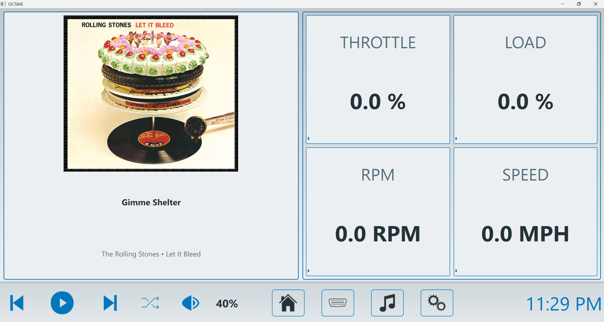
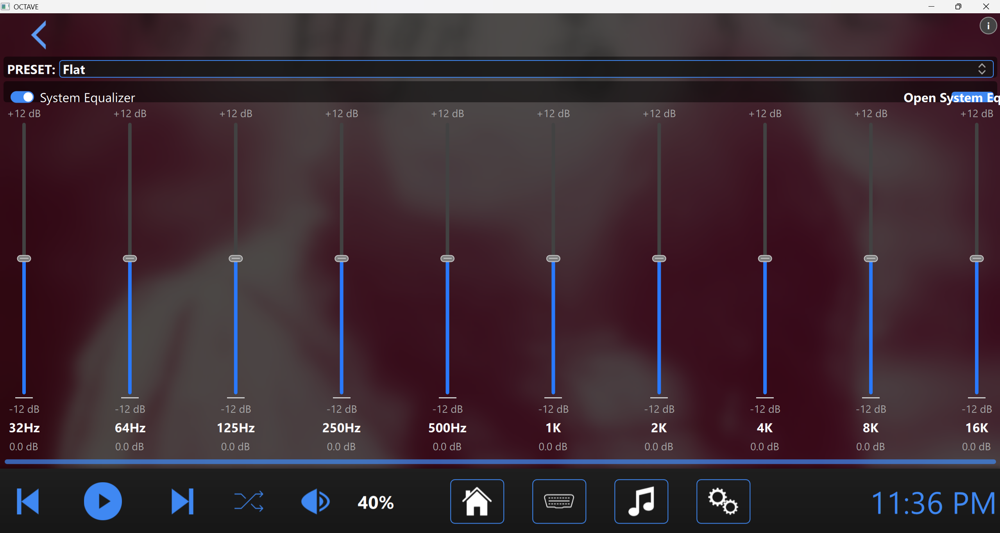
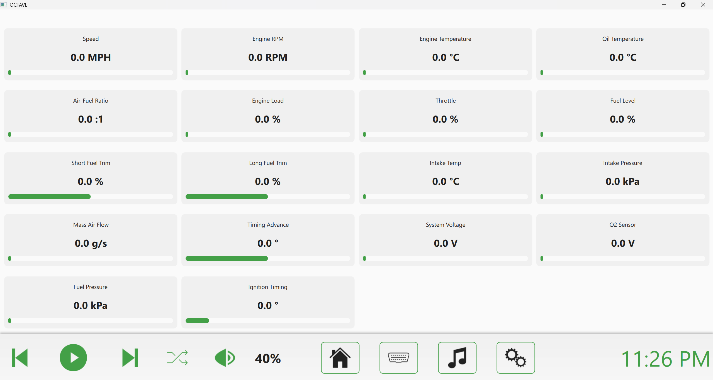

# OCTAVE

## Overview
OCTAVE (Open-source Cross-platform Telematics for Augmented Vehicle Experience) is an open-source infotainment system designed to provide a seamless interface for vehicle systems, media playback, navigation, and OBD-II diagnostics.

## Features
- **Media Player**: Album art display, playlist management, and music library organization  
- **Integrated Equalizer**: Visual equalizer with customizable presets and system equalizer support  
- **OBD-II Integration**: Real-time vehicle diagnostics with customizable dashboard  
- **Customizable UI**: Multiple built-in themes and ability to create custom themes  
- **Cross-Platform**: Compatible with Windows, Linux, and macOS  

## Screenshots





## System Requirements
- **Minimum Screen Resolution**: 800x480 (recommended: 1280x720 or higher)  
- **Memory**: 2GB RAM minimum  
- **OBD Functionality**: Bluetooth-enabled OBD-II adapter  
- **Equalizer Performance**: System-level equalizer software  
- **Operating Systems**: Windows 10+, Ubuntu 20.04+, macOS 11+  

## Installation

### Prerequisites
- Python 3.8 or newer  
- PySide6 (Qt for Python)  
- Python-OBD library  
- Mutagen (for media metadata)  
- Additional dependencies listed in `requirements.txt`  

---

### Windows Installation

1. Open Command Prompt as administrator or PowerShell with elevated privileges:
   ```powershell
   Set-ExecutionPolicy -ExecutionPolicy RemoteSigned -Scope CurrentUser
   ```

2. Navigate to your desired installation location:
   ```cmd
   cd C:\Users\YourUserName\Documents
   ```

3. Clone the repository and enter the directory:
   ```cmd
   git clone https://github.com/waybetterengineering/octave.git
   cd octave
   ```

4. Create and activate a virtual environment:
   ```cmd
   python -m venv venv
   venv\Scripts\activate
   ```

5. Install dependencies:
   ```cmd
   pip install -r requirements.txt
   pip install --upgrade numpy pint
   ```

6. For equalizer support, install Equalizer APO for system-wide equalizer support.

7. Launch the application:
   ```cmd
   python main.py
   ```

---

### Linux Installation

1. Open a terminal window.

2. Navigate to your desired installation location:
   ```bash
   cd ~/Documents
   ```

3. Clone the repository and enter the directory:
   ```bash
   git clone https://github.com/waybetterengineering/octave.git
   cd octave
   ```

4. Create and activate a virtual environment:
   ```bash
   python -m venv venv
   source venv/bin/activate
   ```

5. Install dependencies:
   ```bash
   pip install -r requirements.txt
   pip install --upgrade numpy pint
   ```

6. For OBD support, ensure you have permissions to access the Bluetooth device:
   ```bash
   sudo usermod -a -G dialout $USER
   ```
   (You may need to log out and back in for this to take effect.)

7. For equalizer functionality, install EasyEffects:
   ```bash
   flatpak install flathub com.github.wwmm.easyeffects
   ```

8. Launch the application:
   ```bash
   python main.py
   ```

---

### macOS Installation

1. Open Terminal.

2. Navigate to your desired installation location:
   ```bash
   cd ~/Documents
   ```

3. Clone the repository and enter the directory:
   ```bash
   git clone https://github.com/waybetterengineering/octave.git
   cd octave
   ```

4. Create and activate a virtual environment:
   ```bash
   python -m venv venv
   source venv/bin/activate
   ```

5. Install dependencies:
   ```bash
   pip install -r requirements.txt
   pip install --upgrade numpy pint
   ```

6. For equalizer support, consider installing eqMac.

7. Launch the application:
   ```bash
   python main.py
   ```

---

## Contributing
Contributions are welcome! Please feel free to submit a Pull Request.

1. Fork the repository  
2. Create your feature branch:  
   ```bash
   git checkout -b feature/amazing-feature
   ```
3. Commit your changes:  
   ```bash
   git commit -m "Add some amazing feature"
   ```
4. Push to the branch:  
   ```bash
   git push origin feature/amazing-feature
   ```
5. Open a Pull Request  

---

## License
Copyright © 2025 WayBetterEngineering  
This software is released under the MIT License.
